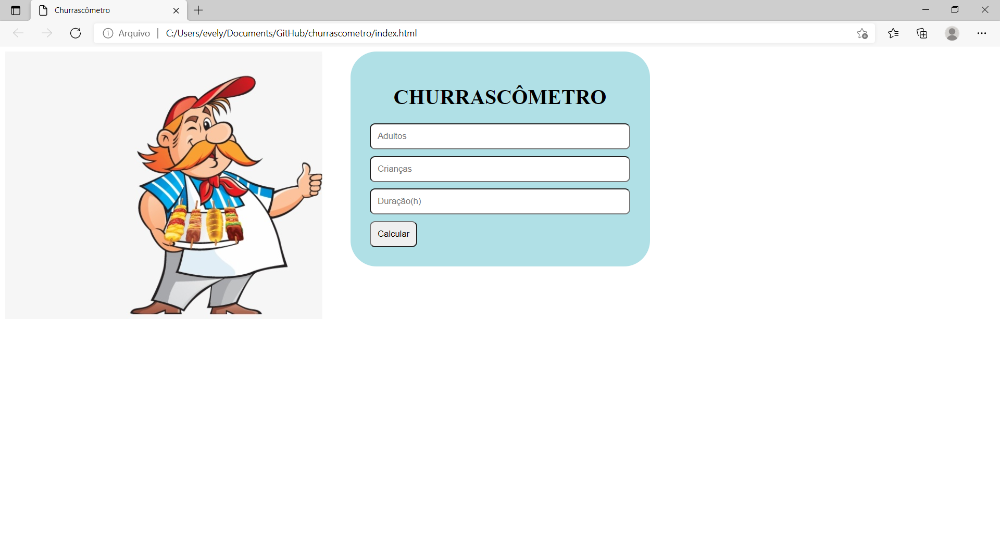
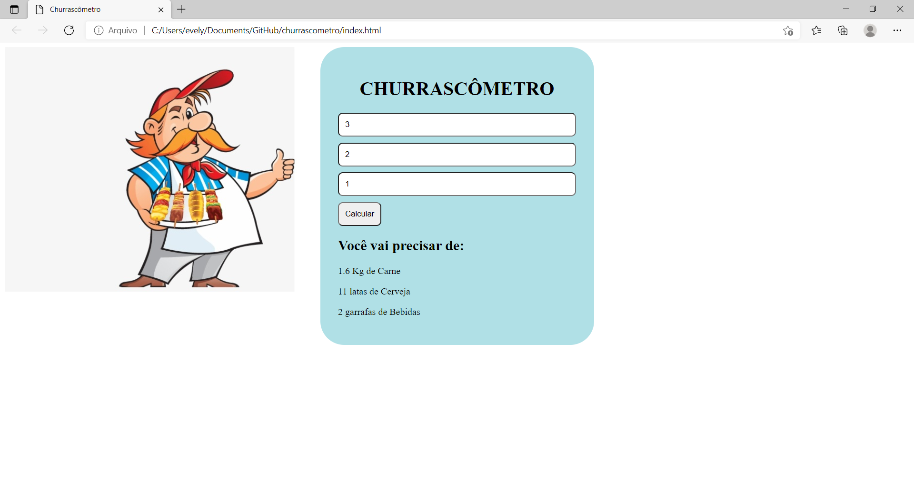

# Projeto Churrascômetro
 
Calcula a quantidade de comida e bebida necessário para realizar o seu churrasco, dependendo da quantidade de adultos, crianças e o tempo de duração.

### Utilizado:
* HTML
* CSS
* Javascript

* ## Exemplo:

